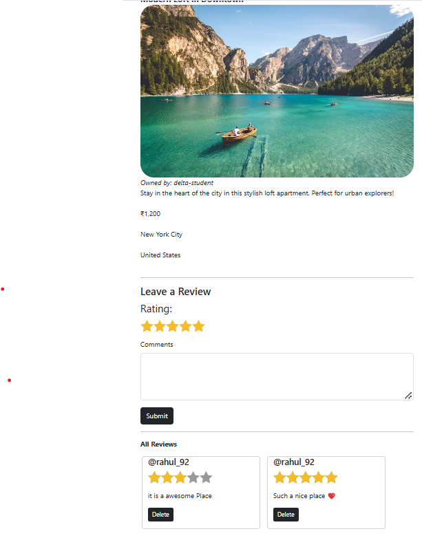
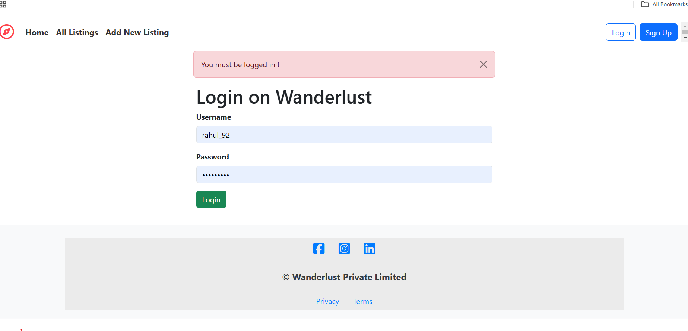
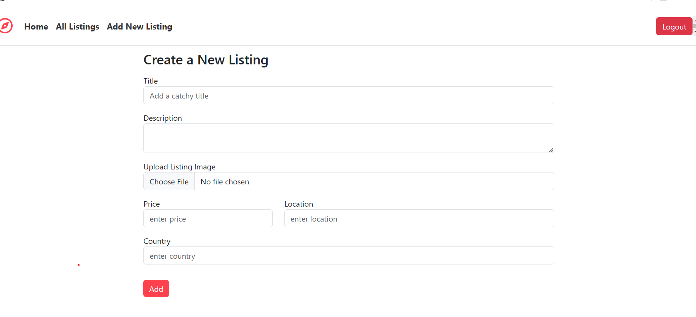

# HotelCrud App

## Link to use my HotelCrudApp
https://hotelcrudapp.onrender.com/listings
## Project Screenshots

Here are some screenshots of the HotelCrudApp:

### All Listing Page


### Card Detailed Page


### Login Page


### New Listing Page


## Project Demo

You can watch a demo of the HotelCrudApp here:

[](https://www.youtube.com/watch?v=JuraNCiCa2A)

Alternatively, you can [click here to watch the video](https://www.youtube.com/watch?v=JuraNCiCa2A).

## Overview
HotelCrud App is a full-stack web application designed to manage hotel listings, user reviews, and images in an efficient and user-friendly manner. This app allows users to browse hotel listings, leave reviews, and rate the hotels based on their experiences. Administrators can manage listings, reviews, and user accounts seamlessly.

Built with the **MERN stack** (MongoDB, Express.js, Not React ,Node.js), this application implements CRUD operations to create, read, update, and delete hotel listings, reviews, and other related data. Additionally, it integrates **Cloudinary** for image storage, allowing users to upload photos for each hotel.

## Features
- **User Authentication:** 
  - Secure login and registration system using **Passport.js** and **local strategy**.
  - Authentication middleware ensures only logged-in users can post reviews or manage hotel listings.
- **Hotel Listings:**
  - Browse hotels with detailed information including title, description, location, price, and images.
  - Admin users can create, update, or delete hotel listings.
  - Reviews can be added to each listing.
- **Reviews and Ratings:**
  - Users can rate hotels from 1 to 5 stars.
  - Reviews and ratings are displayed on hotel pages.
  - Admins can manage reviews and delete inappropriate content.
- **Image Upload:**
  - Integrated with **Cloudinary** for efficient image storage.
  - Users can upload images for hotel listings.

## Technologies Used
- **Backend:**
  - Node.js
  - Express.js
  - MongoDB & Mongoose
  - Passport.js (for authentication)
  - Cloudinary (for image storage)
- **Frontend:**
  - EJS Templates for dynamic page rendering
  - Bootstrap 5 (for styling and layout)
- **Other Tools:**
  - Joi (for validation)
  - Method-Override (for PUT and DELETE HTTP methods)
  - Flash (for displaying success/error messages)

## Project Setup

1. Clone the repository:
    ```bash
    git clone https://github.com/RahulKGEC/HotelCrudApp.git
    ```

2. Navigate to the project directory:
    ```bash
    cd HotelCrudApp
    ```

3. Install dependencies:
    ```bash
    npm install
    ```

4. Create a `.env` file in the root directory and add your Cloudinary API credentials:
    ```plaintext
    CLOUD_NAME=your-cloud-name
    CLOUD_API_KEY=your-api-key
    CLOUD_API_SECRET=your-api-secret
    ```

5. Start the application:
    ```bash
    nodemon app.js
    ```

6. Open the app in your browser:
    ```plaintext
    http://localhost:8080
    ```

## Project Structure
The project structure is organized as follows:

- **models/**: This folder holds Mongoose models for the application, including `user`, `listing`, and `review` models.
- **routes/**: Contains Express route files to handle HTTP requests for various functionalities, like managing hotels, user authentication, and reviews.
- **views/**: EJS templates that are used for dynamic page rendering and displaying content to users.
- **public/**: Contains static files such as CSS, images, and other assets.
- **.env**: Stores environment variables, including credentials for Cloudinary and other configurations.
- **app.js**: The main server file that initializes the Express application, connects to the database, and sets up middleware.
- **package.json**: Contains project metadata, scripts, and a list of dependencies required for the project.


